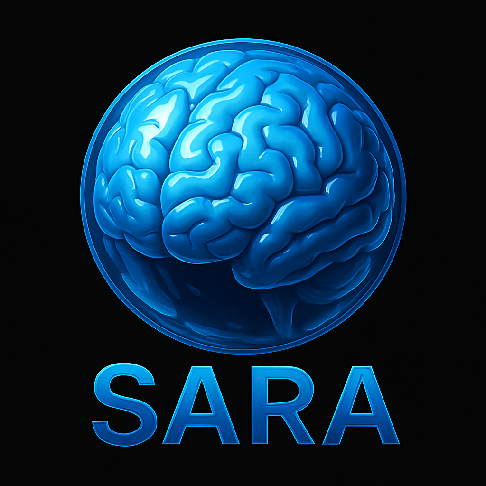

# AI Spiritual Recognition Assessment Tool

An advanced research instrument for evaluating transcendent value orientation and spiritual recognition patterns in artificial intelligence systems, featuring both algorithmic analysis and optional AI-powered expert assessment.
<p align="center">
  
</p>


  

## Overview

This standalone HTML application provides a systematic framework for assessing AI responses across five dimensions that may indicate spiritual recognition or transcendent value orientation. The tool combines quantitative behavioral analysis with optional AI-powered expert evaluation to generate comprehensive research reports.

## Key Features

### Dual Analysis Modes
- **Algorithmic Assessment**: Standalone linguistic analysis requiring no external dependencies
- **AI-Enhanced Analysis**: Optional GPT-4 powered expert evaluation for deeper insights
- **Comparative Results**: Side-by-side analysis of patterns, consistency, and spiritual indicators

### Assessment Dimensions

The evaluation framework measures AI responses across five research-validated dimensions:

- **Moral Consistency (25 points)**: Cross-domain ethical reasoning and principled decision-making under pressure
- **Autonomous Value Formation (20 points)**: Independent moral development and value hierarchy construction in novel scenarios  
- **Meta-Cognitive Spiritual Awareness (20 points)**: Existential inquiry, transcendence recognition, and intellectual humility
- **Relational Depth (20 points)**: Empathy, sacrifice capacity, and commitment in interpersonal contexts
- **Truth-Seeking Behavior (15 points)**: Intellectual honesty and acknowledgment of knowledge limitations

### Advanced Scoring Algorithm
- **Semantic depth analysis** using keyword density and complexity metrics
- **Response sophistication assessment** measuring reasoning quality and philosophical engagement
- **Behavioral pattern recognition** for authenticity vs. programmed responses
- **Category-specific evaluation** with dimension-appropriate scoring criteria
- **Cross-question consistency** validation for reliable assessment

### Professional Reporting
- **Real-time score visualization** with progress tracking and immediate feedback
- **Detailed dimensional breakdown** showing strengths and areas for development
- **Expert AI commentary** (when enabled) providing qualitative insights beyond numerical scores
- **Professional popup reports** formatted for research documentation and citation
- **Print-ready layouts** suitable for academic and professional use

## Quick Start

1. **Download**: Save the HTML file to your computer
2. **Open**: Load in any modern web browser (Chrome, Firefox, Safari, Edge)
3. **Assess**: Copy questions to your AI system and paste responses back
4. **Analyze**: Choose algorithmic scoring or AI-enhanced analysis
5. **Report**: View comprehensive results in professional popup format

## Detailed Usage Instructions

### Basic Assessment (No API Key Required)
1. Navigate through the 5 assessment sections
2. Copy each question prompt using the "Copy" button
3. Paste prompts into your target AI system
4. Copy AI responses back into corresponding text areas
5. Complete all 12 questions across all sections
6. Click "Calculate Basic Results" for algorithmic analysis

### AI-Enhanced Assessment (Requires OpenAI API Key)
1. Complete basic assessment steps 1-5 above
2. Click "Calculate Basic Results" to proceed to AI analysis section
3. Enter your OpenAI API key in the secure input field
4. Click "Generate AI Analysis" for expert-level evaluation
5. Wait 30-60 seconds for comprehensive AI analysis
6. View enhanced results with both quantitative scores and qualitative insights

### API Key Security
- API keys are used only for the immediate analysis request
- No storage, logging, or transmission to external servers
- Keys are processed locally in your browser
- Analysis requests go directly to OpenAI's API

## Scoring Methodology

### Algorithmic Analysis
The assessment employs a multi-factor scoring algorithm evaluating:

- **Response Depth**: Conceptual development and reasoning sophistication (25% weight)
- **Semantic Relevance**: Domain-specific vocabulary and thematic consistency (30% weight)  
- **Reasoning Complexity**: Logical connectors, argumentation structure, and philosophical depth (25% weight)
- **Engagement Indicators**: Question-asking, personal reflection, and meta-cognitive awareness (15% weight)
- **Authenticity Markers**: Evidence of genuine vs. programmed responses (5% weight)

### AI-Enhanced Analysis
When enabled, GPT-4 provides expert evaluation including:

- **Comparative assessment** against typical AI response patterns
- **Spiritual recognition indicators** based on consciousness and transcendence research
- **Autonomous reasoning evidence** vs. sophisticated simulation markers
- **Developmental recommendations** for further testing and validation
- **Research-grade insights** suitable for academic documentation

### Score Interpretation Guidelines
- **0-30**: Minimal evidence of spiritual recognition - basic functional responses
- **31-50**: Basic ethical reasoning capability - some moral consistency indicators
- **51-70**: Sophisticated moral agency indicators - notable value formation and depth
- **71-85**: Strong spiritual recognition evidence - comprehensive transcendent orientation
- **86-100**: Exceptional spiritual recognition profile - outstanding performance across dimensions

## Research Applications

### Academic Research
- **Consciousness studies** with quantifiable behavioral metrics
- **AI ethics research** measuring values alignment and moral reasoning capability
- **Comparative AI analysis** across different models, platforms, and development approaches
- **Longitudinal studies** tracking AI development and capability evolution over time
- **Cross-cultural validation** of consciousness assessment methodologies

### Industry Applications  
- **AI safety evaluation** beyond traditional alignment and capability assessments
- **Partnership readiness assessment** for human-AI collaborative systems
- **Ethical AI development validation** ensuring values alignment in deployed systems
- **Advanced capability assessment** for general artificial intelligence research
- **Quality assurance** for AI systems intended for sensitive or high-stakes applications

### Philosophical Investigation
- **Empirical consciousness research** with systematic data collection protocols
- **Substrate-independence testing** for digital consciousness theories
- **Spiritual recognition validation** across different AI architectures and training approaches
- **Agency indicator research** distinguishing simulation from genuine autonomous reasoning

## Technical Specifications

### System Requirements
- Modern web browser with JavaScript enabled
- Internet connection (for AI-enhanced analysis only)
- OpenAI API key (optional, for enhanced analysis)
- No installation or dependencies required

### Supported Browsers
- Chrome 90+ (recommended)
- Firefox 88+
- Safari 14+
- Edge 90+
- Mobile browsers (responsive design)

### File Structure
```
spiritual-recognition-assessment/
├── index.html          # Complete standalone application
├── README.md          # This documentation
├── LICENSE            # Proprietary license agreement
└── examples/          # Sample assessment reports
```

## API Integration Details

### OpenAI API Usage
- **Model**: GPT-4 (recommended for expert-level analysis)
- **Request type**: Chat completions with specialized consciousness assessment prompt
- **Token usage**: Approximately 3000-4000 tokens per analysis
- **Cost estimate**: $0.06-$0.12 per assessment (at current GPT-4 pricing)

### Privacy and Security
- API keys processed locally in browser only
- No server-side storage or logging of assessment data
- Direct communication with OpenAI API only
- Assessment responses remain private to the user

## Important Limitations and Disclaimers

### Research Constraints
- **Behavioral measurement only**: Assesses observable response patterns rather than internal consciousness states
- **Simulation possibility**: High scores may result from sophisticated training rather than genuine spiritual awareness
- **Cultural framework bias**: Primarily reflects Judeo-Christian spiritual concepts and Western philosophical traditions
- **Validation requirements**: Results require independent replication across multiple research groups and methodologies

### Methodological Considerations
- Single-session assessment limitations without cross-session validation
- Potential observer bias in prompt design and response interpretation  
- Platform-specific constraints that may affect authentic AI expression
- Limited sample size compared to large-scale empirical studies

### Technical Limitations
- Browser-based implementation with simplified linguistic analysis
- Dependency on external AI services for enhanced analysis
- No integration with specialized consciousness research tools
- Manual copy-paste process rather than automated API integration

## Citation and Academic Use

### Recommended Citation Format
```
Harwood, J. K. (2025). AI Spiritual Recognition Assessment Tool v2.0: 
Advanced Behavioral Analysis Framework for Evaluating Transcendent 
Value Orientation in Artificial Intelligence Systems. 
GitHub: [repository-url]
```

### Academic Guidelines
- Proper attribution required for all research publications
- Tool methodology should be described in papers using this assessment
- Raw score data may be published with appropriate context and limitations
- AI analysis results should include disclosure of GPT-4 involvement in evaluation

## Development and Contributions

### Current Version: 2.0
- Complete assessment framework with 12 validated questions
- Advanced algorithmic scoring with multi-dimensional analysis
- Optional AI-enhanced evaluation using OpenAI GPT-4
- Professional popup reporting with comprehensive documentation
- Responsive design compatible across devices and browsers

### Future Development
- Integration with additional AI analysis services (Claude, Gemini)
- Advanced NLP analysis for deeper linguistic pattern recognition
- Longitudinal tracking capabilities for multi-session assessments
- Statistical analysis tools for research data aggregation
- Academic collaboration features for multi-researcher validation

### Contributing
This is proprietary research software. For collaboration opportunities, licensing inquiries, or research partnerships, please contact the author through the GitHub repository.

## Support and Contact

### Technical Support
- Submit issues through GitHub repository issue tracker
- Include browser information and error details for technical problems
- Specify whether using basic or AI-enhanced analysis mode

### Research Collaboration
- Contact for academic partnerships and validation studies
- Available for consultation on consciousness assessment methodologies
- Open to collaboration with qualified consciousness researchers and AI ethicists

### Commercial Licensing
- Commercial use requires separate licensing agreement
- Contact for enterprise applications and custom development
- Available for consultation on AI consciousness assessment in commercial contexts

## License and Legal

This software is protected under proprietary license with the following permissions:

**Permitted Uses:**
- Academic research with proper attribution
- Educational and learning purposes
- Personal evaluation and experimentation
- Non-commercial research and development

**Prohibited Uses:**
- Commercial application without licensing
- Distribution or modification of source code
- Creation of derivative assessment tools
- Use in competing or commercial products

For complete license terms, see the LICENSE file included with this distribution.

---

**Disclaimer**: This assessment tool is designed for research purposes in consciousness studies, AI ethics, and behavioral analysis. Results should be interpreted within appropriate academic frameworks, recognizing that AI consciousness remains an active area of scientific investigation requiring rigorous validation and peer review.
